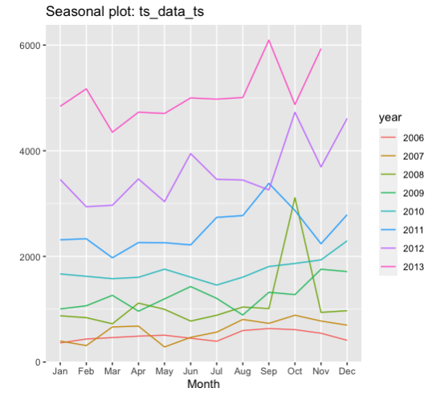

### Fargo Health, Data Analytical Case Study

 <!-- This adds the line below the title -->

This project involved developing a data-driven approach to predict incoming examination demand at Fargo Health’s healthcare centers. Due to a shortage of examining physicians, the company had to outsource patients to Outpatient Clinics (OCs), incurring significant costs. By leveraging time series analysis and ARIMA modeling, I provided actionable insights for reallocation of physicians and optimized scheduling to meet demand more effectively.

<a href="https://github.com/your-github-link" style="color:#6a0dad;">View project on GitHub</a>

  

    
<strong>Figure 1:</strong> Incoming Interpolate Time Series with Moving Average

    
  

  

    
<strong>Figure 2:</strong> Seasonal Plot

    
  

  

    
<strong>Figure 3:</strong> Prediction Results Using ARIMA

    
  

