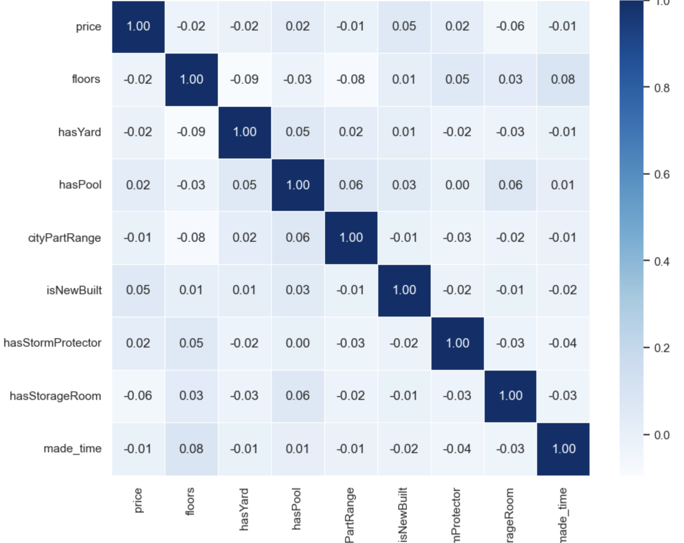
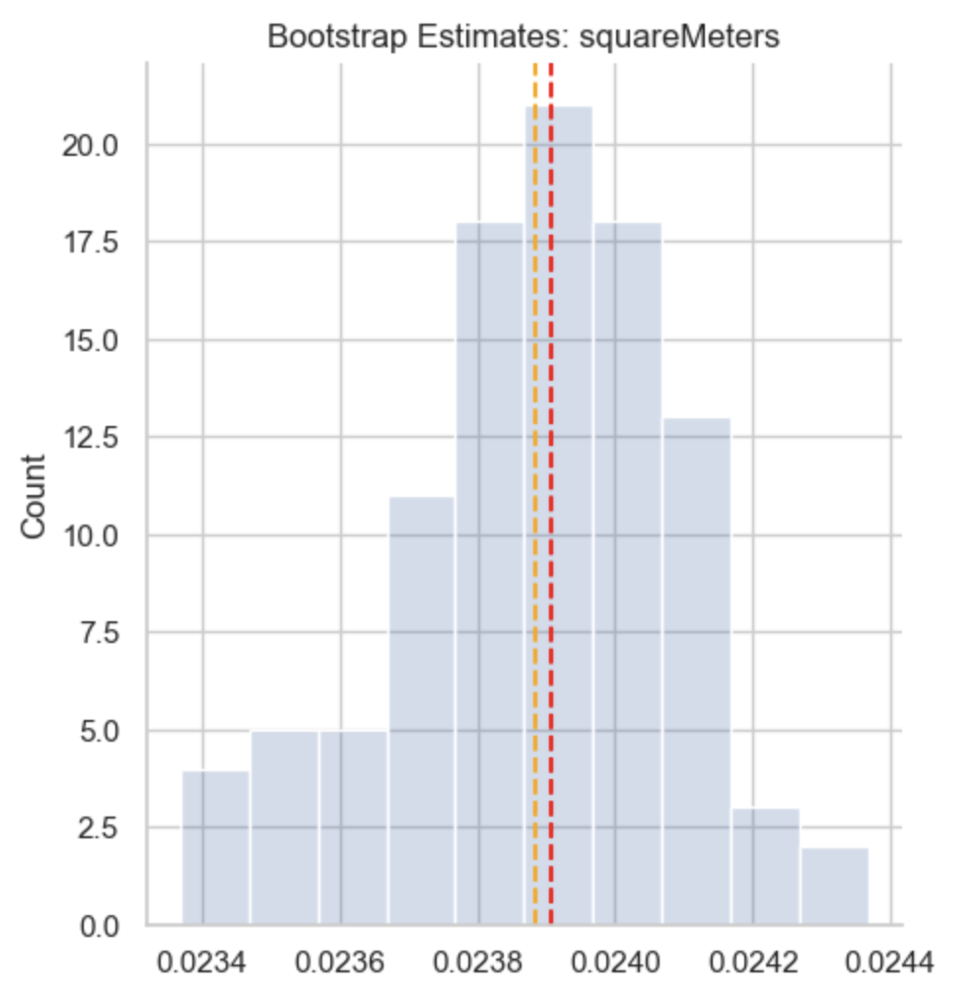

## Projects 

 <!-- This adds the line below the title -->
### Tableau Dashboard for Payroll Operations, University of California

This project involved developing an automated, real-time Tableau dashboard that dynamically monitored tax forms and paycheck issuance for enhanced payroll decision-making. I designed a SQL-automated pipeline that fed live data into Tableau, utilizing dynamic filters to enable targeted analysis reports and generate actionable insights in real time. Additionally, I applied time series forecasting using Python’s `statsmodels` library (ARIMA) to predict future file volumes, aiding in optimized resource allocation and improved operational efficiency.

  <h3>Tableau Demo</h3>
  <video width="500" height="350" controls>
    <source src="images/Tableau Demo.mov" type="video/mp4">
    Your browser does not support the video tag.
  </video>

### Fargo Health, Data Analytical Case Study

This project involved developing a data-driven approach to predict incoming examination demand at Fargo Health’s healthcare centers. Due to a shortage of examining physicians, the company had to outsource patients to Outpatient Clinics (OCs), incurring significant costs. By leveraging time series analysis and ARIMA modeling, I provided actionable insights for reallocation of physicians and optimized scheduling to meet demand more effectively.

<a href="https://github.com/RaghaviRajumohan/Business-Analysis-Report/tree/main" style="color:#6a0dad;">View project on GitHub</a>

  

    
<strong>Figure 1:</strong> Incoming Interpolate Time Series with Moving Average

    
  

  

    
<strong>Figure 2:</strong> Seasonal Plot

    
  

  

    
<strong>Figure 3:</strong> Prediction Results Using ARIMA

    
  

### House Price Prediction Model, Predictive Regression Models

This project involved developing a predictive model for house prices using mulitple regression. After cleaning and preprocessing the data, key features were selected through correlation analysis and the Boruta Algorithm. I developed OLS, logit and polynomial multiple regression models, selecting the best one based on R-squared, MSE, and cross-validation results. Visualization techniques helped uncover trends and insights in the model’s predictions. This project highlights my ability to handle the entire regression modeling process, from feature selection to model evaluation, delivering meaningful insights for real estate pricing.

<a href="https://github.com/RaghaviRajumohan/Regression-Models-" style="color:#6a0dad;">View project on GitHub</a>

  

    
<strong>Figure 1:</strong> Correlation Plot of Predictive Variables

    
  

  

    
<strong>Figure 2:</strong> Bootstrap Estimates for Model Stability

    
  

  

    
<strong>Figure 3:</strong> QQ Plot of Residuals

    
  

